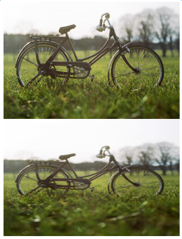
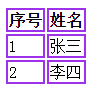
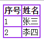

20个编写现代CSS代码的建议

<!--more-->

# 防止margin collapse，统一使用margin-bottom进行排版

# 使用flexbox进行布局（IE10以上才支持flex）

# 使用CSS reset

# 一切应为Border-box，方便在固定宽高的父元素内进行布局

  用户界面属性box-sizing的两种取值：
  - 默认值：content-box，此时元素的宽高仅为content宽高
  - border-box，元素的宽高为content+padding+border总和

# 以背景图的方式使用Image

在响应式环境下展示图片可以以背景图的方式使用Image，详见css样式实践文档backgroundimage.html文件
```
<head>
    <meta charset="utf-8">
    <title>background image</title>
    <style type="text/css">
        div {
            width: 300px;
            height: 200px;
            background: url('bicycle.jpg');
            background-position: center center; //图片中心与元素中心重合
            background-size: cover; //取图片宽度按比例缩放图片
        }
    </style>
</head>
<body>
    <div></div>
    
</body>
```

效果对比图：


# Better Tabel border

使用border-collapse:collapse，美化table的border

```
<body>
    <table>
        <tr>
            <th>序号</th>
            <th>姓名</th>
        </tr>
        <tr>
            <td>1</td>
            <td>张三</td>
        </tr>
        <tr>
            <td>2</td>
            <td>李四</td>
        </tr>
    </table>
</body>
```

美化前
```
<style type="text/css">
        th, td {
            border: solid 2px #9E32EA;
        }
    </style>
```



美化后
```
    <style type="text/css">
        table {
            border-collapse: collapse; //一定要定义在table上
        }
        th, td {
            border: solid 2px #9E32EA;
        }
    </style>
```



# 注释优化

单行注释
```
/*  comment  */
```

多行注释
```
/*----------------
  ##Comment
----------------*/
```

# 使用Kebab-case命名变量

对于样式类名或者ID名的命名都需要在多个单词之间添加`-`符号，CSS本身是大小写不敏感的因此你是用不了camelCase的，另一方面，很久之前也不支持下划线，所以现在的默认的命名方式就是使用`-`

# 避免代码重复

注意可继承属性，避免代码重复

# 使用transform添加动画（IE10完全支持，IE9部分支持2D转换）

# 尽可能使用低优先级的选择器

# 避免使用!important

唯一的可以使用!important属性的场景就是当你想去复写某些行内样式的时候，不过行内样式本身也是需要避免的。

# 使用text-transform属性设置文本大写

`text-transform : none | capitalize | uppercase | lowercase`

- none 无效果
- capitalize 首字母大写
- uppercase 全部大写
- lowercase 全部小写
