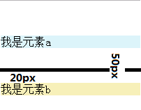
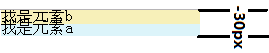
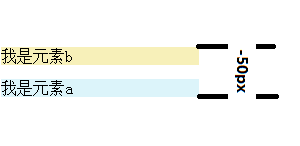
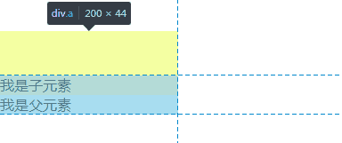

本文详细讨论不同关系的块的外边距叠加的效果。

<!--more-->

# 外边距叠加

当两个垂直外边距相遇时，它们将合并成一个外边距，合并后的外边距的高度等于两个发生合并的外边距的高度中的较大者。

意义：外边距叠加的设计意义是为了使叠加的段落间间距为单倍外边距，而不是两倍外边距，如下图所示。


# 兄弟元素间的外边距叠加

```html
<div class="a">我是元素a</div>
<div class="b">我是元素b</div>
```

## 外边距都为正

```css
.a {
    background-color: #DCF4FA;
    width: 200px;
    margin-bottom: 50px;
}
.b {
    background-color: #F7F0B9;
    width: 200px;
    margin-top: 20px;
}
```

a, b间距叠加，间距为两个元素的最大外边距50px，效果如下图所示


## 外边距一正一负

```css
.a {
    background-color: #DCF4FA;
    width: 200px;
    margin-bottom: -50px;
}
.b {
    background-color: #F7F0B9;
    width: 200px;
    margin-top: 20px;
}
```

a, b间距叠加，间距为两个元素的正外边距-负外边距，效果如下图所示



## 外边距都为负

```css
.a {
    background-color: #DCF4FA;
    width: 200px;
    margin-bottom: -50px;
}
.b {
    background-color: #F7F0B9;
    width: 200px;
    margin-top: -20px;
}
```

a, b间距叠加，间距为两个元素的外边距的最小值，效果如下图所示



# 父子元素间的外边距叠加

```html
<div class="a">
    <div class="b">我是子元素</div>
    我是父元素
</div>
```

```css
.a {
    background-color: #DCF4FA;
    width: 200px;
    margin-top: 50px;
}
.b {
    background-color: #F7F0B9;
    width: 200px;
    margin-top: 20px;
}
```

子元素的外边距与父元素的外边距叠加，效果图为
