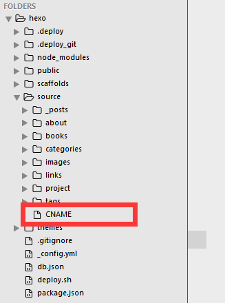

简述为github博客添加域名的方法，以hexo架构为例

<!--more-->

# 添加CNAME文件

博客代码根目录下添加CNAME文件

目录结构如下图：



CNAME文件内容为域名 （无www前缀）

```//CNAME
dorali.win
```

# 域名解析配置

登录阿里域名控制台，点击对应域名 后的【解析】 ，进入域名解析配置页面，配置信息如下：


这样几分钟后后就可以访问你的博客啦！